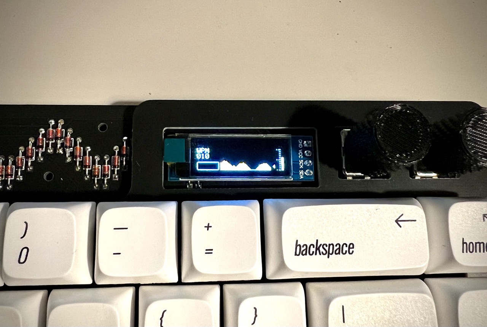

# lagom

Lagom is an easy to build 65%ish keyboard using only through hole components. It uses a separate microcontroller (like the Pro Micro or Elite C) to enable flexibility in connectivity and to further simplify the soldering experience (no more tricksy USB ports).

* Keyboard Maintainer: [mohoyt](https://github.com/mohoyt)
* Hardware Supported: lagom, Pro Micro, Elite-C, Puchi-C, Nice!Nano and more...
* Hardware Availability: [sthlm kb](https://sthlmkb.com)

Make example for this keyboard (after setting up your build environment):

    make sthlmkb/lagom:default

See the [build environment setup](https://docs.qmk.fm/#/getting_started_build_tools) and the [make instructions](https://docs.qmk.fm/#/getting_started_make_guide) for more information. Brand new to QMK? Start with our [Complete Newbs Guide](https://docs.qmk.fm/#/newbs).

NB If you want to flash a Vial compatible image then you have to use the [Vial fork of QMK](https://github.com/vial-kb/vial-qmk) and ensure that you have all the Vial specific files present (but these should already be there if you're using on the Vial keymaps as a starting point).

Alternatively flash one of the precompiled hexes. There's a few options:
* One's a Vial compatible image one with bongocat
* Another's a Vial image with a WPM graph on it

